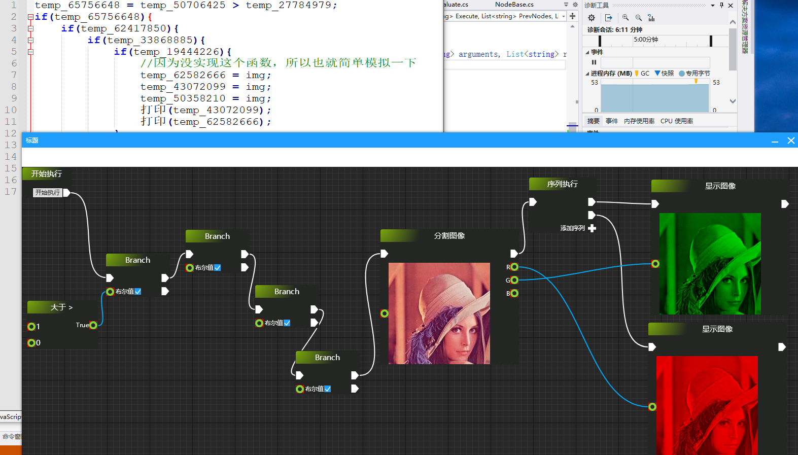

# BluePrint
可视化节点编辑器

## 编译 

> 首先net开发首选windows+vs,此库是使用vs+ [CPF](http://cpf.cskin.net/) 开发,支持可视化设计拖动节点, 所以想要liunx或者mac开发也不是不行，只不过要自己研究

> 为了方便演示我编译了liunx和mac的各个版本的demo来供大家下载测试 
 

## 介绍
> 基于[CPF](http://cpf.cskin.net/) 框架开发的一款类似于蓝图的组件 

>> 先放几张图

> 相比大多数开源的可视化蓝图组件，此控件及其完善，可以开箱即用，架构灵活支持任意的项目需求来自由定制

> 支持实时预览执行节点，也支持动态生成代码，也可以做脑图之类的工具，自由定制，欢迎使用
